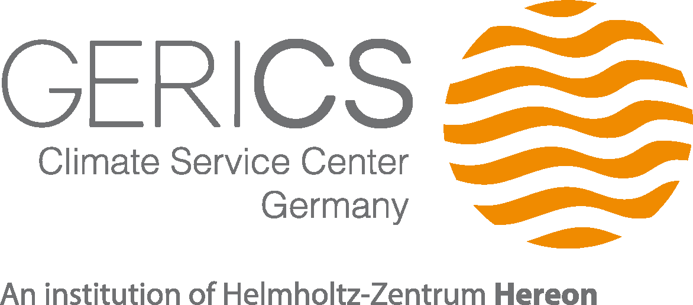

The Climate Service Center Germany (GERICS) is an independent scientific organizational entity of the [Helmholtz‐Zentrum Hereon](https://www.hereon.de). 
The interdisciplinary team at GERICS develops scientifically based prototype products and services to support decision-makers in politics, business and public administration in adapting to climate change.
